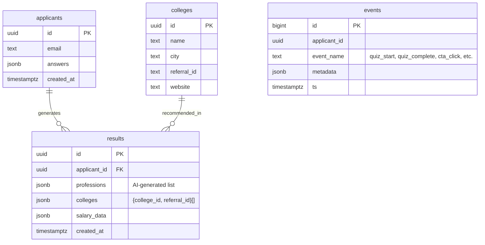

# Career‑Diagnosis MVP Architecture Document

## 1 System Overview (High‑Level)

### 1.1 Context Diagram

```
User (Mobile/Web)
   │ HTTPS
   ▼
NextJS Frontend (Vercel)  ──▶  Supabase Postgres (EU‑central‑1)
   │                         ▲
   │ REST (supabase-js)      │ RLS, Realtime
   ▼                         │
n8n Webhook (Hostinger VPS) ─┘
   │ ChatCompletion
   ▼
OpenAI API (GPT‑4o)
```

### 1.2 Component Summary

| Layer    | Service | Purpose |
| -------- | ------- | ------- |
| Frontend |         |         |

| **NextJS 14** (App Router) + Tailwind + ShadCN | Display questionnaire, collect data, show AI results        |                                                               |
| ---------------------------------------------- | ----------------------------------------------------------- | ------------------------------------------------------------- |
| Authentication                                 | **Supabase Auth** (Magic Link)                              | Secure user session & row ownership                           |
| Data Store                                     | **Supabase Postgres** (`applicants`, `results`, `colleges`) | Persist raw answers & AI output with RLS                      |
| Automation & AI                                | **n8n** (Docker on Hostinger VPS)                           | Trigger on new applicant row, call OpenAI, write back results |
| AI Model                                       | **OpenAI GPT‑4o**                                           | Generate professions, colleges, salary ranges                 |
| Hosting & Infra                                | **Vercel** (Frontend), **Hostinger VPS** (n8n)              | CI/CD, SSL, monitoring                                        |

### 1.3 Key Architectural Decisions

1. **Serverless Frontend on Vercel** – leverages global edge network; minimal ops.
2. **Supabase as BaaS** – Postgres, auth, storage, and vector store in one.
3. **n8n Self‑Hosted** – keeps AI logic off frontend, allows no‑code iteration; isolates API keys.
4. **GPT‑4o for Inference** – balanced cost/performance for Hebrew + English output; throttling handled via n8n retry.
5. **Row Level Security** – ensures user isolation and GDPR compliance without custom middleware.

---

*(This section is owned by ****architect****; editors: pm, analyst. Others read‑only.)*


## 2 Detailed Component Design

### 2.1 Frontend (NextJS 14 – App Router)

| Sub‑Component   | Technology                      | Responsibilities                                  |
| --------------- | ------------------------------- | ------------------------------------------------- |
| **UI Layer**    | TailwindCSS + ShadCN            | Mobile‑first form, results dashboard, CTA buttons |
| **State Mgmt**  | React Context + Zustand (light) | Persist form answers client‑side until submit     |
| **Auth**        | `@supabase/auth-helpers-nextjs` | Magic‑link sign‑in / session cookies              |
| **Data Access** | `@supabase/supabase-js`         | CRUD to `applicants`, realtime sub to `results`   |
| **Deployment**  | Vercel Edge Network             | ISR for landing page, SSR for results             |

**Rationale:** Vercel provides zero‑config CI/CD; Edge cache gives <150 ms TTFB nationwide.

### 2.2 Automation & AI (n8n on Hostinger VPS)

| Node                            | Purpose                                          |
| ------------------------------- | ------------------------------------------------ |
| **Webhook (Supabase Realtime)** | Triggers on new row in `applicants`              |
| **Function: Build Prompt**      | JS node formats user data → JSON prompt          |
| **OpenAI ChatCompletion**       | Calls GPT‑4o with system/user content            |
| **Parse Response**              | JS node maps JSON to DB columns                  |
| **Postgres Insert**             | Writes to `results` table                        |
| **If Error**                    | Notifies Slack & retries 3× exponential back‑off |

**Scaling Note:** Each n8n exec uses ≤100 MB RAM; Hostinger VPS (2 GB) supports 10 concurrent execs.

### 2.3 Data Layer (Supabase Postgres)

| Table          | Key Columns                                                                                 | Purpose                        |
| -------------- | ------------------------------------------------------------------------------------------- | ------------------------------ |
| `applicants`   | id (uuid, pk), user\_id, jsonb answers, created\_at                                         | Raw questionnaire data         |
| `results`      | id, applicant\_id (fk), professions jsonb, colleges jsonb, salary\_range jsonb, created\_at | AI output                      |
| `colleges`     | id, name, referral\_id, city, min\_score                                                    | Reference lookup               |
| `events`       | id, user\_id, event\_name, context jsonb, ts                                                | Analytics & KPI tracking       |
| `salary_cache` | profession, median, pct75, source, updated\_at                                              | Static dataset nightly refresh |

*RLS Policies:* Row‑owner on `applicants`, `results`; `events` insert‑only for client key; `colleges` = public read.

### 2.4 Vector Store (Phase 2)

Uses Supabase pgvector extension on `professions_embeddings` for semantic matching once baseline KPIs met.

### 2.5 Observability & Ops

- **Metrics**: Prometheus Node Exporter + n8n built‑in stats → Grafana dashboard.
- **Logs**: Supabase Logflare; Vercel analytics; n8n file logs (rotated weekly).
- **Alerting**: UptimeRobot ping cron + Slack webhook on failures.

### 2.6 Security Model

- TLS 1.3 enforced end‑to‑end.
- Supabase Auth JWT signed w/ HS256; short‑lived access token (1 h).
- Secrets stored in Vercel & Hostinger env vars.

---


## 3 Data Model & Integration Interfaces

### 3.1 Relational Schema (Supabase Postgres)



### 3.2 Vector Store (Phase 2)

- Table: `profession_embeddings` (id, profession, embedding)
- Table: `value_embeddings` (id, value, embedding)
- Future JOIN via cosine similarity in Supabase functions.

### 3.3 API Contracts

| Endpoint                           | Method | Auth          | Payload / Response                |
| ---------------------------------- | ------ | ------------- | --------------------------------- |
| `/api/submit`                      | POST   | Session JWT   | `{answers}` → `201 Created`       |
| `/api/results/:id`                 | GET    | Session JWT   | `{professions, colleges, salary}` |
| n8n Webhook `/hooks/new-applicant` | POST   | Service Token | Row data (`applicants.*`)         |

### 3.4 Data Privacy & Compliance

1. PII encrypted at rest (Supabase SSE).
2. Row Level Security: `auth.uid() = applicants.id`.
3. Data retention: purge applicants & results after 24 months.


## 4 Deployment & Infrastructure

### 4.1 Target Environments

| Env         | Purpose                                             | URL Pattern                  | Notes                              |
| ----------- | --------------------------------------------------- | ---------------------------- | ---------------------------------- |
| **Dev**     | Local dev (`localhost`) using Supabase Docker stack | `http://localhost:3000`      | Hot‑reload, stubbed OpenAI key     |
| **Staging** | Pre‑prod sanity on separate Supabase project        | `https://staging-career.app` | Protected via magic‑link whitelist |
| **Prod**    | Public MVP                                          | `https://career.app`         | GDPR banner, full observability    |

### 4.2 Deployment Diagram

```mermaid
deployGraph LR
    subgraph Vercel Cloud
        FE[NextJS 14 App Router]
    end
    subgraph Hostinger VPS (Docker + Traefik)
        N8N[n8n container]
        PROM[Prometheus]
        GRAF[Grafana]
    end
    subgraph Supabase Cloud (EU‑central‑1)
        PG[Postgres + RLS]
        RT[Supabase Realtime]
        FUNC[Edge Functions]
    end
    FE -->|supabase-js| PG
    PG -->|realtime insert| N8N
    N8N -->|ChatCompletion| GPT(OpenAI)
    PROM <-- N8N
    PROM <-- FE
    GRAF <-- PROM
```

### 4.3 CI/CD Pipeline Overview

| Stage        | Tool                     | Trigger          | Key Steps                                                |
| ------------ | ------------------------ | ---------------- | -------------------------------------------------------- |
| **Frontend** | GitHub Actions → Vercel  | `push` to `main` | Lint → Unit Tests → Deploy Preview → Promote             |
| **n8n**      | GitHub Actions → VPS SSH | Tag `n8n-*`      | Build Docker image → `docker compose pull && up -d`      |
| **Supabase** | Supabase Migrations      | PR merge         | `supabase db diff` → `supabase db push` (staging → prod) |

### 4.4 Infrastructure as Code & Secrets

- **Terraform Cloud** manages VPS, DNS, Supabase project variables.
- Use **Doppler** for secret management; inject via GitHub Actions.
- **Traefik** TLS certificates via Let’s Encrypt (DNS‑01).

### 4.5 Rollback & Disaster Recovery

| Scenario            | RTO      | RPO      | Mechanism                                      |
| ------------------- | -------- | -------- | ---------------------------------------------- |
| Frontend bad deploy | ≤ 30 min | 0        | Vercel instant rollback                        |
| n8n container crash | ≤ 15 min | ≤ 1 h    | Watchtower auto‑restart; nightly volume backup |
| DB corruption       | ≤ 4 h    | ≤ 15 min | Supabase PITR + WAL backups                    |

### 4.6 Cost Estimate (Monthly)

| Service         | Cost        | Notes                           |
| --------------- | ----------- | ------------------------------- |
| Vercel Hobby    | \$0         | Up to 100 GB bandwidth          |
| Supabase Pro    | \$25        | 8 GB RAM, 8 M Realtime messages |
| VPS (Hostinger) | \$10        | 2 vCPU, 4 GB RAM                |
| OpenAI Usage    | \$200 cap   | GPT‑4o pay‑as‑you‑go            |
| Doppler         | \$15        | Secrets sync                    |
| **Total**       | **≈ \$250** | within budget                   |


## 5 Security, Compliance & Observability

### 5.1 Security Controls

| Layer    | Control                           | Description                               |
| -------- | --------------------------------- | ----------------------------------------- |
| Frontend | HTTPS everywhere                  | Vercel automatic TLS                      |
| Auth     | Magic‑link (Supabase)             | Short‑lived JWT, Audience="authenticated" |
| Data     | Row Level Security                | Policies on `applicants`, `results`       |
| Secrets  | Doppler (prod) / .env.local (dev) | Central secret management                 |
| Network  | VPS UFW                           | Allow 22,80,443, deny rest                |

### 5.2 Compliance

- **GDPR Consent Checkbox** – explicit consent to share data w\...

